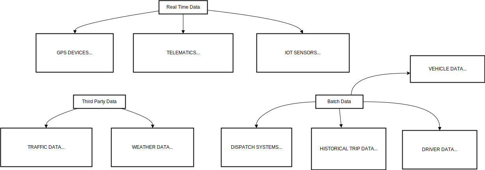

# Real-Time Fleet Management System
Fleet tracking and logistics optimization involve monitoring and managing the movement of vehicles in real time to enhance operational efficiency, reduce costs, improve safety, and ensure timely delivery of goods and services

### Project Goals
- **_Real-Time Tracking_**: Monitor the movement of each vehicle in the fleet, identify their current location and progress towards assigned tasks.
- **_Route Optimization_**: Analyze real-time traffic conditions, historical data, and delivery schedules to dynamically calculate the most efficient routes for each vehicle. This can consider factors like distance, traffic congestion, fuel consumption, and driver availability.
- **_Driver Behavior Monitoring_**: Analyze driver behavior data (speeding, harsh braking, idling) to identify areas for improvement and promote safe driving practices.
- **_Predictive Maintenance_**: Analyze sensor data from the vehicles to predict potential maintenance issues before they occur, preventing breakdowns and optimizing maintenance schedules.
- **_Analytics and Reporting_**: Generate reports and insights to improve decision-making.

### Expected Outcomes and Benefits:
- **_Reduced Fuel Consumption_**: Optimized routes minimize unnecessary travel and idling, leading to significant fuel cost savings.
- **_Improved Delivery Times_**: Efficient route planning and real-time traffic updates ensure on-time deliveries and enhance customer satisfaction.
- **_Reduced Operational Costs_**: Optimized routes and improved driver behavior lead to less wear and tear on vehicles, minimizing maintenance costs.
- **_Enhanced Driver Safety_**: Monitoring driver behavior allows for coaching and training programs, promoting safe driving practices.
- **_Increased Operational Visibility_**: Real-time fleet tracking allows dispatchers to monitor progress, respond to issues promptly, and make informed decisions.

### Data Sources
- **_GPS Devices_**: Installed in vehicles to provide real-time location data (latitude, longitude), speed, direction.
- **_Telematics_**: Data from vehicle sensors (e.g., fuel level, engine status).
- **_IoT Sensors_**: Additional sensors for temperature, load weight, etc.
- **_Traffic Data_**: Real-time traffic updates from third-party services.
- **_Weather Data_**: Current and forecasted weather conditions from third-party services.
- **_Dispatch Systems_**: Data on delivery tasks, pick-up locations, and drop-off points can be integrated for a holistic view.
- **_Historical Trip Data_**: Past delivery times, traffic patterns, and driver behavior data can be used for route optimization algorithms.

### Data Model

### Tech Stack
- DBT
- Airflow
- Iceberg
- Kafka
- Spark
- Python